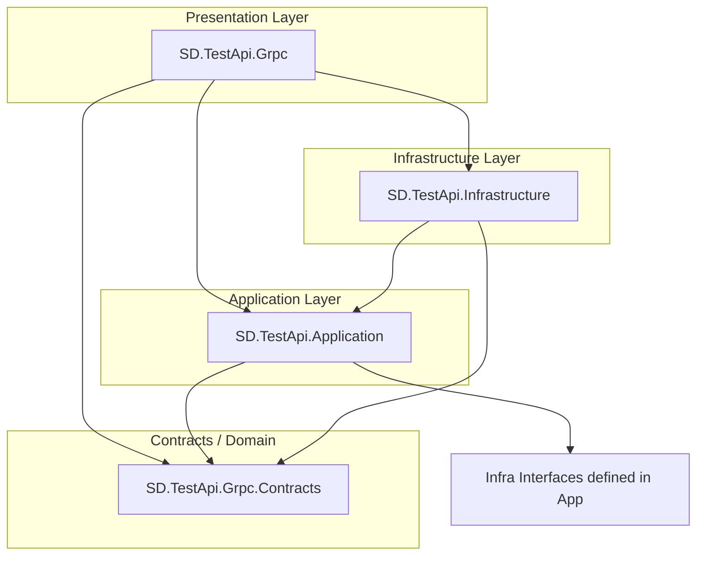

# Service Implementation Documentation

## Overview

This document describes the architecture and implementation details of the `SD.TestApi` gRPC service. The service is designed to act as a **Cart Assistant**, aggregating data from multiple sources (Database, External API, JSON Files) to provide a personalized product selection experience.

## Feature Documentation

Detailed documentation for each feature can be found in the following files:

-   **[Get Cart Assistant Data](feature_get_cart_assistant_data.md)**: The core data aggregation query.
-   **[Save Settings](feature_save_settings.md)**: Configuration management command.
-   **[Image Service](feature_image_service.md)**: Fuzzy matching logic for images.

## Architecture

The solution follows a **Clean Architecture** (or Onion Architecture) approach, strictly separating concerns into layers.

### Layer Diagram

## Internal Principles

### 1. Code-First gRPC
We use `protobuf-net.Grpc` to define services using C# Interfaces and DTOs.

### 2. Dependency Injection
All services are registered in the DI container with appropriate lifetimes (`Scoped` vs `Singleton`).

### 3. Result Pattern
All internal logic uses the `Result<T>` pattern instead of exceptions for flow control, ensuring predictable error handling.

### 4. CQRS
All use cases are implemented as **Commands** or **Queries** mediated by **MediatR**.

## Configuration
- **Database**: Connection string `DefaultConnection` in `appsettings.json`.
- **Docs Path**: The service logic automatically looks for the `docs/` folder in parent directories to locate `settings.json`, `images.json`, and `data-response.json` for seeding and mocking.
